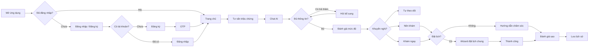

# Patient User Flows / Luồng người dùng Bệnh nhân

One account type: **Bệnh nhân / Khách hàng**. Registration + OTP only for this role.

## Người cần khám bệnh

```mermaid
flowchart LR
  A["Mở ứng dụng"] --> B{"Đã đăng nhập?"}
  B -->|"Chưa"| C["Đăng nhập / Đăng ký"]
  B -->|"Rồi"| D["Trang chủ"]
  C --> D
  D --> E["Chọn Đặt lịch khám"]
  E --> F{"Biết chuyên khoa?"}
  F -->|"Không chắc"| G["Nhập triệu chứng AI gợi ý"]
  G --> H["Chọn chuyên khoa"]
  F -->|"Có"| H
  H --> I["Chọn Bác sĩ"]
  I --> J["Chọn Phòng khám"]
  J --> K["Chọn ngày khám"]
  K --> L["Chọn khung giờ"]
  L --> M{"Điền phiếu khám trước?"}
  M -->|"Có"| O["Phiếu khám và Upload XN"]
  O --> P["Tóm tắt đặt lịch"]
  M -->|"Bỏ qua"| P
  P --> Q{"Xác nhận?"}
  Q -->|"Chỉnh sửa"| E
  Q -->|"Xác nhận"| R["Đặt lịch thành công"]
  R --> S["Mã QR và thông báo"]
  S --> T["Kết thúc"]
```

## Người cần tư vấn

## Shared booking funnel (English)

Both flows converge on `appointment-booking-wizard.tsx` — single implementation, entries: `home`, `symptom-consultation`.
